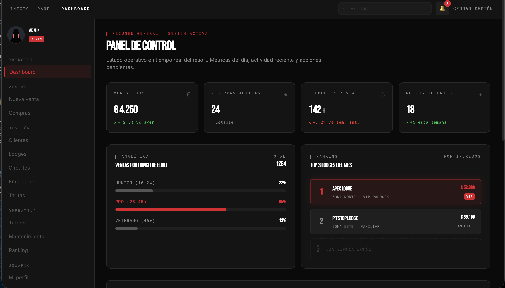
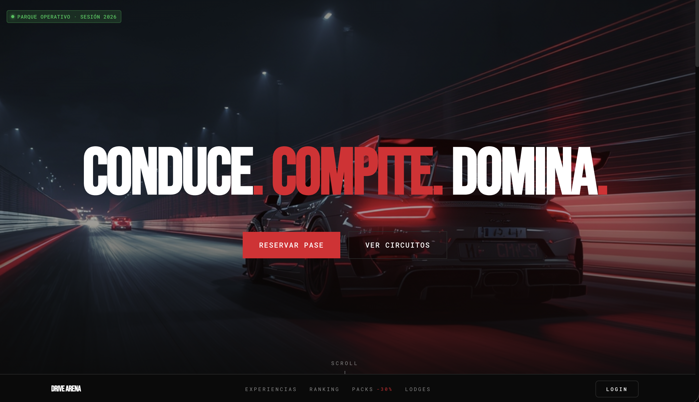
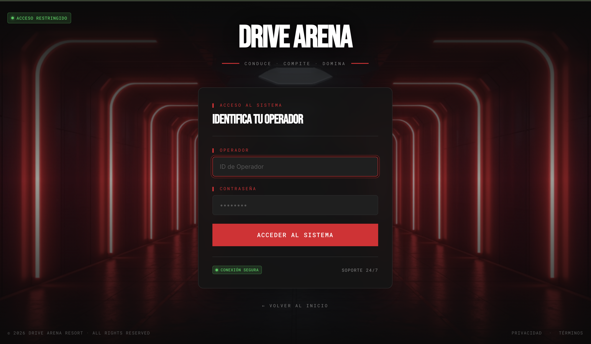
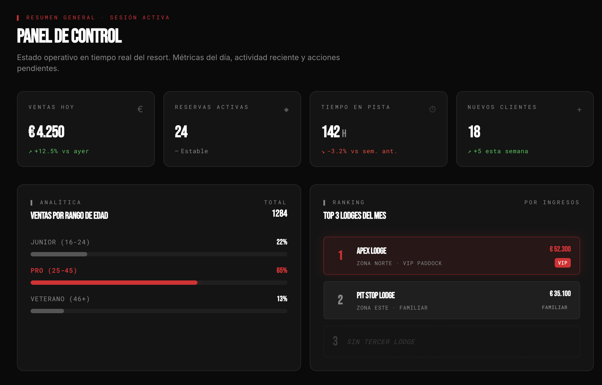
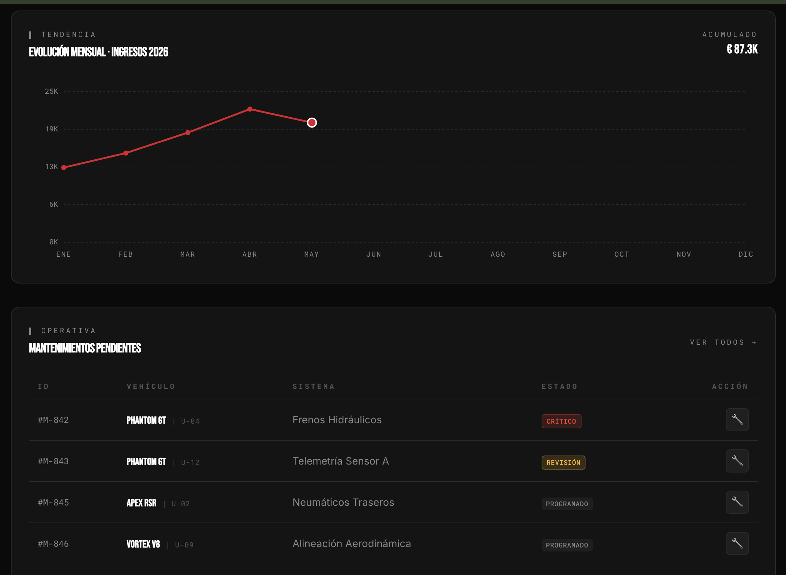

<div align="center">

# 🏎️ Drive Arena — Frontend

**Resort experiencial motorsport** · Hotel · Circuitos · Simulador VR · Gamificación


</div>

> 🎓 **Trabajo Final de Grado — CFGS Desarrollo de Aplicaciones Web** · Sprint final: 22 mayo 2026

---

<p align="center">
  
</p>

> 📌 _Las capturas viven en `docs/screenshots/`. Reemplaza los placeholders con tus imágenes reales._

---

## ✨ Features

### ✅ Implementado

- 🌐 **Home pública** — landing con narrativa de marca, hero motorsport y CTAs hacia reserva y experiencias
- 🔐 **Autenticación JWT** — login con Spring Security en backend, roles `ADMIN` y `TAQUILLA`
- 🛡️ **Rutas protegidas** — `ProtectedRoute` y `PublicOnlyRoute` con redirección por rol y persistencia de sesión
- 🧭 **Dashboard layout** — sidebar rica con navegación segmentada, topbar con breadcrumbs, buscador, notificaciones y logout
- 📊 **Dashboard analítico** — KPIs del día, ventas por rango de edad, top lodges, evolución mensual de ingresos (SVG nativo) y mantenimientos pendientes
- 🎨 **Design System V1.0** — tokens centralizados en `index.css`, identidad cyber-motorsport coherente

### 🚧 En desarrollo

- 🏨 **Lodges** — CRUD completo (catálogo, edición, asignación de zonas)
- 👥 **Clientes** — alta, búsqueda e historial de reservas
- 🏁 **Circuitos** — gestión de pistas y disponibilidad
- 💼 **Empleados** — alta, roles y turnos
- 💰 **Tarifas** — configuración dinámica por experiencia y temporada
- 🛠️ **Mantenimiento** — vista completa de tickets con estados y asignación
- 🏆 **Ranking** — sistema de gamificación con récords y podios
- 🛒 **POS** — flujo de Nueva Venta y Compras

---

## 📸 Capturas

<table>
  <tr>
    <td align="center" width="50%">
      
      <br /><sub><b>Home pública</b> · Hero motorsport y narrativa de marca</sub>
    </td>
    <td align="center" width="50%">
      
      <br /><sub><b>Login</b> · Autenticación JWT con roles</sub>
    </td>
  </tr>
  <tr>
    <td align="center" width="50%">
      
      <br /><sub><b>Dashboard</b> · KPIs del día y ventas por rango de edad</sub>
    </td>
    <td align="center" width="50%">
      
      <br /><sub><b>Dashboard</b> · Evolución mensual de ingresos (SVG nativo)</sub>
    </td>
  </tr>
</table>

---

## 🏎️ Stack

| Capa | Tecnología |
|------|------------|
| Bundler | Vite 8 |
| UI | React 19 + JavaScript (sin TypeScript) |
| Estilos | Tailwind CSS v4 (Design System propio) |
| Routing | React Router 7 |
| HTTP | Axios |
| Forms | React Hook Form + Zod |
| Animación | Framer Motion |
| Iconos | Lucide React |
| Fechas | date-fns |
| Toasts | react-hot-toast |
| Charts | SVG nativo (zero deps) |

---

## 🚀 Setup

```bash
# 1. Clonar
git clone https://github.com/BryanStrk/drive-arena-frontend.git
cd drive-arena-frontend

# 2. Instalar dependencias
npm install

# 3. Configurar variables de entorno
cp .env.example .env

# 4. Arrancar en modo desarrollo
npm run dev
```

Por defecto arranca en `http://localhost:5173`.

> ⚠️ Requiere que el [backend Drive Arena](https://github.com/BryanStrk/drive-arena-backend) esté corriendo en `localhost:8080`.

---

## 🔐 Variables de entorno

Todas las variables expuestas al frontend deben tener prefijo `VITE_`.

| Variable | Descripción | Ejemplo |
|----------|-------------|---------|
| `VITE_API_URL` | URL base del backend | `http://localhost:8080/api` |

⚠️ **Nunca commitear `.env`** — usar `.env.example` como plantilla pública.

---

## 📁 Estructura

```
src/
├── api/          Clientes Axios y endpoints por entidad
├── components/   Componentes reutilizables
├── constants/    Enums del backend, valores fijos
├── context/      React Contexts (Auth, etc.)
├── hooks/        Custom hooks
├── layouts/      Layouts (Dashboard, Auth)
├── lib/          Lógica de negocio pura
├── pages/        Pantallas (rutas)
└── utils/        Helpers genéricos
```

---

## 🎨 Sistema de diseño

**Drive Arena Design System V1.0** — definido como design tokens en `src/index.css`.

### Backgrounds

| Token | HEX | Uso |
|-------|-----|-----|
| `--color-bg` | `#0A0A0A` | Brand Black — fondo global |
| `--color-surface-1` | `#141414` | Cards, panels |
| `--color-surface-2` | `#1F1F1F` | Hover, elevated |
| `--color-border` | `#1A1A1A` | Bordes sutiles |
| `--color-border-strong` | `#2A2A2A` | Bordes definidos |

### Brand

| Token | HEX | Uso |
|-------|-----|-----|
| `--color-primary` | `#E0162B` | Primary Red — CTAs, acentos |
| `--color-primary-dark` | `#C01225` | Dark Red — hover, pressed |
| `--color-primary-glow` | `#E0162B33` | Sombras y halos rojos |

### Semantic

| Token | HEX | Uso |
|-------|-----|-----|
| `--color-success` | `#00C853` | Estado online, éxito |
| `--color-danger` | `#FF3B30` | Errores, alertas |
| `--color-warning` | `#FFB800` | Revisión, advertencias |

### Typography

| Token | Familia | Uso |
|-------|---------|-----|
| `font-display` | Saira | Headlines, números grandes |
| `font-sans` | Inter | Body, formularios, legibilidad |
| `font-mono` | JetBrains Mono | Datos, métricas, código |

### Conventions

- **Cards**: `bg-surface-1` con `border border-border-strong` y `rounded-card`
- **Inputs**: `bg-surface-2` sin border en estado normal
- **CTAs primarios**: `bg-primary hover:bg-primary-dark` con texto blanco mayúsculas
- **Status indicators**: dot 8px con shadow del color correspondiente

---

## 🗺️ Roadmap

| Versión | Hito | Estado |
|---------|------|--------|
| `v0.1.0` | Home pública completa | ✅ Released |
| `v0.2.0` | Auth API con Spring Boot | ✅ Released |
| `v0.3.0` | Protected routes + dashboard layout | ✅ Released |
| `v0.4.0` | Dashboard con widgets analíticos | ✅ Released |
| `v0.5.0` | CRUD de Lodges (primer módulo de gestión) | 🚧 In progress |
| `v1.0.0` | Defensa TFG | 🎯 22 mayo 2026 |

---

## 🛠️ Convenciones de desarrollo

### Commits — [Conventional Commits](https://www.conventionalcommits.org/)

| Tipo | Uso |
|------|-----|
| `feat:` | Nueva funcionalidad |
| `fix:` | Bug fix |
| `chore:` | Mantenimiento (deps, configs) |
| `refactor:` | Refactor sin cambio funcional |
| `docs:` | Documentación |
| `build:` | Cambios en build/deps |

### Branching

```
main ─────────────────●────────●─────  (releases con tag vX.Y.Z)
                      │        │
dev ──●──●──●──●──────●────●───●─────  (línea de trabajo activa)
       \        /          \   /
        feature/x         fix/y
```

- Trabajo en `feature/*` o `fix/*` desde `dev`
- Merge con `--no-ff` a `dev` para preservar historia
- `dev` → `main` en hitos, con tag `vX.Y.Z`

---

## 🔗 Backend

Repositorio: **[drive-arena-backend](https://github.com/BryanStrk/drive-arena-backend)**

- Spring Boot 4 + Java 25
- MySQL + JPA / Hibernate
- JWT authentication (roles `ADMIN` / `TAQUILLA`)
- API REST en `/api/*`
- Swagger UI en `/swagger-ui.html`

---

## 📜 Scripts

| Comando | Acción |
|---------|--------|
| `npm run dev` | Servidor de desarrollo (puerto 5173) |
| `npm run build` | Build de producción a `/dist` |
| `npm run preview` | Preview del build de producción |
| `npm run lint` | Linter ESLint |

---

## 👤 Autor

**Bryan Paico** · [@BryanStrk](https://github.com/BryanStrk)

> _Proyecto de Trabajo Final de Grado · CFGS Desarrollo de Aplicaciones Web · 2025–2026_
